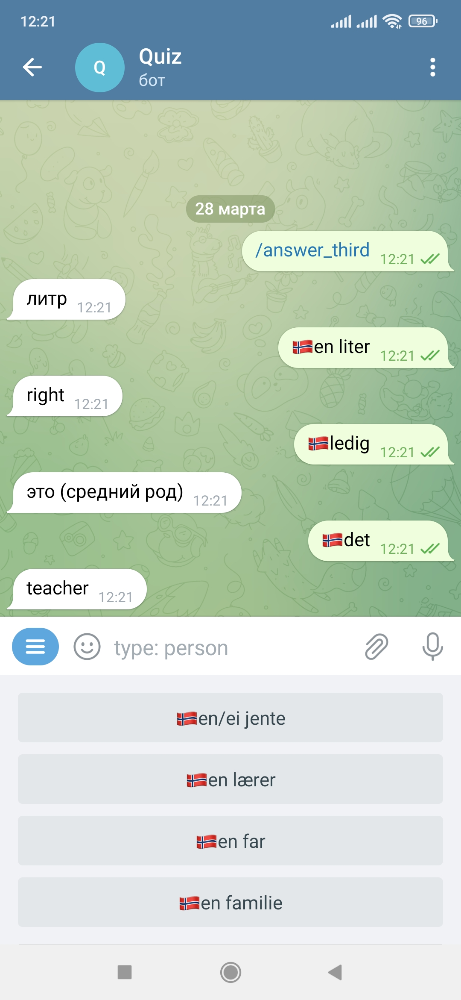

# bot_quiz

#### About 
Этот бот поможет вам в изучении одного или нескольких иностранных языков. Он может формировать опрос на основе вашего __.xlsx__ файла. 

После завершения опроса, выводится результат со словами на всех языках. Так же отображаются и неправильные варианты ответа, если они есть.

 

---

###### Режимы работы опроса 

* С фильтрацией по типу (с любого языка на любой язык)
* Без фильтрации
* Тестовый с фильтрацией по типу
* С ответом на "первый" язык с фильтрацией по типу 
* С ответом на "второй" язык с фильтрацией по типу
* С ответом на "третий" язык с фильтрацией по типу
* С ответом на "четвертый" язык с фильтрацией по типу

---

###### Работа с .xlsx файлом

Для начала работы необходимо отправить боту таблицу с расширением .xlsx. 1-4 колонка - соответствуют любым четырем языкам, заполнить нужно хотя бы две из них. В 5-7 колонку можно указать тип данного слова, по которому и будет происходить фильтрация при выборе варианта ответа, то есть все варианты ответа будут одного типа. Структура таблицы выглядит следующим образом:

lng | lng | lng | lng | type | type | type
:----|:----------:|:----------:|:----------:|:----------:|:----------:|--------:
просыпаться | wake | våkne | | verb
есть | eat | spise | | verb
хотеть | want | vil | | verb
далеко | far | langt | | adjective
около | near | nær | | adjective
далеко | far | langt | | adjective

---

#### Distribute

- Ссылка на телеграм бота [Quiz](https://t.me/The_Language_Quiz_Bot)

---

#### Developers

- [PTavadian](https://github.com/PTavadian)